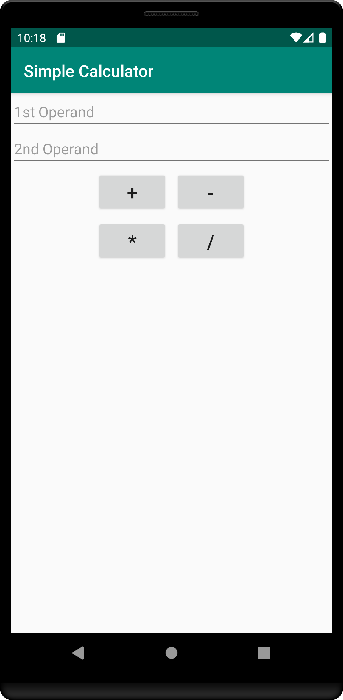

Simple Mobile Calculator Application
===================================
I am beginning to explore mobile software development, and decided that a simple calculator would be a good starting project. I built this as a way to get used to Android Studio, as well as begin to learn Kotlin in conjunction with XML structuring.

### Simple Calculator GUI:

After entering operands, the user must click on an operation and the result will appear underneath the operation buttons.
